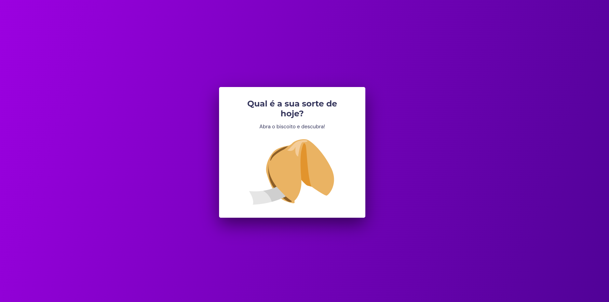

<h1 align="center"> Biscoito da sorte </h1>

Projeto desenvolvido individualmente, onde  ao clicar na imagem do biscoito é gerado uma frase de forma aleatória para o usuário.

  
  

#### Esse projeto foi desenvolvido com as seguintes tecnologias:

- HTML e CSS
- JavaScript
- Git e Github
